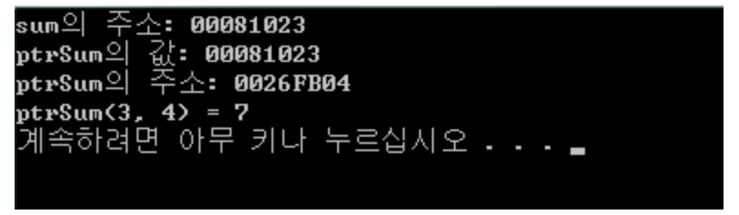

# 40강 - 예제
## 함수포인터
- `int (*ptrsum) (int a, int b);`
    - int : 반환형
    - (*ptrSum) : 함수포인터명
    - (int a, int b) : 매개변수 (없을땐 void나 빈괄호)
    ```c
    #include <stdio.h>
    int sum(int a, int b) { 
            return a + b;
    }

    int main() {
            int(*ptrSum)(int a,int b);  //함수포인터 선언 
            ptrSum = sum;  // sum의 함수 주소를 ptrSum에 넣는다.
            printf("sum의 주소: %p\n", &sum); //&sum은 sum과 같음 
            printf("ptrSum의 값: %p\n", ptrSum);
            printf("ptrSum의 주소: %p\n", &ptrSum);
            printf("ptrSum(%d, %d) = %d\n", 3, 4, ptrSum(3, 4));
    }
    ```
    